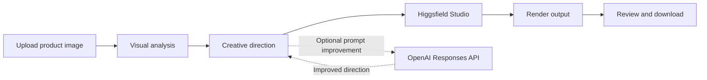
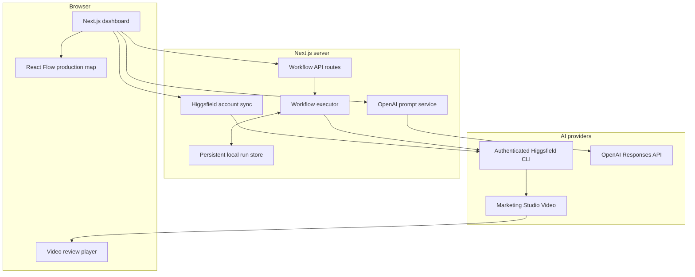

<div align="center">

# UGC Genie

### Turn one product image into a complete, visible AI UGC video workflow.

UGC Genie is an open-source production dashboard for creating vertical product videos with Higgsfield. Upload a product image, add creative direction, follow every stage on a live node canvas, and review the generated video without leaving the application.

[](LICENSE)
[](https://nextjs.org/)
[](https://www.typescriptlang.org/)
[](https://higgsfield.ai/)

</div>

---

## Overview

Most AI video tools hide production behind a spinner. UGC Genie makes the workflow understandable and operational: product intake, visual analysis, creative direction, video generation, rendering, and delivery are represented as explicit nodes with persistent state.

The application is designed as a useful foundation rather than a fixed SaaS product. Creators can run it as a personal studio; agencies can adapt it for client delivery; consultants can use it as a reusable automation asset; and product teams can extend the provider boundary into a commercial application.

## Who it is for

| Audience | How UGC Genie helps |
| --- | --- |
| Creators | Produce vertical product videos through a clear, repeatable workflow instead of managing disconnected generation steps. |
| Creative agencies | Standardize product intake, generation status, output review, and client-facing production operations. |
| AI consultants | Use the repository as a production-shaped starting point for customized AI UGC systems. |
| Product owners | Fork the provider architecture, add authentication and billing, and turn the workflow into a specialized product. |
| Marketing teams | Create a shared interface for experimenting with product-led short-form creative. |

## Core capabilities

- Reliable product-image selection with drag-and-drop, validation, preview, replacement, and removal states
- Editable creative-direction prompt with OpenAI-powered prompt improvement
- Audio on/off control carried into Higgsfield generation
- Live React Flow canvas with six production stages
- Persistent workflow state that is not tied to a component animation
- Real Higgsfield Marketing Studio Video execution through the authenticated local CLI
- Embedded vertical-video review and download experience
- Credit-free demonstration path for presentations and onboarding
- Live Higgsfield account balance with periodic and manual refresh
- Server-side credential boundaries for OpenAI and Higgsfield operations
- Responsive Shadcn interface using a restrained claymorphism visual system

## Workflow



Each node moves through a defined lifecycle:

```text
pending -> running -> completed
                   -> failed
```

The percentage displayed in the interface summarizes workflow-stage progress. It is not a model-level estimate supplied by Higgsfield.

## Architecture



### Design principles

1. **The canvas visualizes state; it does not execute the workflow.** Server-side code owns orchestration and persistence.
2. **Provider operations stay on the server.** Browser code never receives OpenAI credentials or direct Higgsfield command access.
3. **The Higgsfield boundary is replaceable.** The current CLI runner can later be swapped for a direct API adapter without rebuilding the dashboard.
4. **Run state is explicit.** Every workflow step has a status, progress value, timestamps, and an operator-facing message.
5. **Failure is visible.** Provider and validation errors are surfaced without destroying the user's input.

## Technology stack

| Layer | Technology | Responsibility |
| --- | --- | --- |
| Application | Next.js 16 App Router | UI, server routes, and production build |
| Language | TypeScript | Shared contracts and type-safe implementation |
| Interface | React 19 | Interactive dashboard state |
| Components | Shadcn UI / Base UI | Accessible application primitives |
| Styling | Tailwind CSS 4 | Design tokens and responsive layout |
| Theme | TweakCN claymorphism | Soft production-desk visual language |
| Workflow canvas | `@xyflow/react` | Nodes, edges, controls, and live state visualization |
| Motion | Motion | Focused transitions and result reveals |
| Validation | Zod | API inputs and provider-response validation |
| AI video | Higgsfield CLI / Marketing Studio Video | UGC video generation and live credit status |
| Prompt improvement | OpenAI Node SDK / Responses API | Production-ready creative-direction rewriting |
| Persistence | Local JSON run store | Development run records and refresh-safe state |
| Package manager | pnpm | Reproducible dependency management |

## Repository structure

```text
UGC-dashboard/
├── app/
│   ├── api/
│   │   ├── higgsfield/account/     # Live account and credit synchronization
│   │   ├── prompt/improve/         # Server-side OpenAI prompt improvement
│   │   └── workflows/              # Create, list, and inspect workflow runs
│   ├── globals.css                 # Theme tokens and workflow-node styling
│   ├── layout.tsx                  # Metadata and application providers
│   └── page.tsx                    # Dashboard composition
├── components/
│   ├── layout/                     # Sidebar, shell, and account card
│   ├── ui/                         # Shadcn primitives
│   └── workflow/                   # Studio, canvas, and custom nodes
├── lib/
│   ├── higgsfield/                 # Higgsfield provider execution boundary
│   └── workflow/                   # Definitions, executor, and persistent store
├── hooks/                          # Shared responsive behavior
├── types/                          # Workflow contracts
├── public/                         # Static public assets
├── .env.example                    # Safe configuration template
├── LICENSE                         # MIT License
└── package.json
```

Generated product uploads, workflow records, browser artifacts, build output, and local environment files are intentionally excluded from Git.

## Prerequisites

Install the following before running the project:

- Node.js 20 or newer
- pnpm 10 or newer
- A Higgsfield account with available generation credits
- The Higgsfield CLI, authenticated on the machine running the Next.js server
- An OpenAI API key if you want the **Improve prompt** feature

### Install and authenticate Higgsfield

Follow the official Higgsfield CLI installation process, then authenticate interactively:

```bash
higgsfield auth login
higgsfield account status
```

The second command must return the authenticated email, plan, and current credit balance. UGC Genie invokes the CLI from server-side routes, so the CLI must be available on the server's `PATH`.

## Local setup

### 1. Clone the repository

```bash
git clone https://github.com/harshith-vaddiparthy/UGC-dashboard.git
cd UGC-dashboard
```

### 2. Install dependencies

```bash
pnpm install
```

### 3. Configure environment variables

```bash
cp .env.example .env.local
```

Add your standard OpenAI API key to `.env.local`:

```env
OPENAI_API_KEY=your_openai_api_key
OPENAI_PROMPT_MODEL=gpt-5.6-sol
```

The OpenAI key is optional. Without it, the main Higgsfield workflow still operates, but prompt improvement will return a clear configuration message.

Never commit `.env.local`. It is already excluded by `.gitignore`.

### 4. Start the development server

```bash
pnpm dev
```

Open [http://localhost:3000](http://localhost:3000).

### Safe public deployment

Set both runtime variables to `public-demo` when deploying without the Higgsfield API:

```env
UGC_RUNTIME_MODE=public-demo
NEXT_PUBLIC_UGC_RUNTIME_MODE=public-demo
```

This actively disables local CLI account access and real generation. The primary action runs the credit-free demonstration workflow instead. Do not attempt to copy a local Higgsfield CLI session into a public cloud deployment.

## Using UGC Genie

1. Choose or drag a JPG, PNG, or WebP product image into the product card.
2. Confirm the preview and filename. Use **Replace** or **Remove** if needed.
3. Write the most important product story or creator direction.
4. Optionally select **Improve prompt** to rewrite the direction through OpenAI.
5. Turn generated audio on or off.
6. Select **Run workflow** to start a real Higgsfield generation.
7. Watch the six workflow nodes move through their current states.
8. Review and download the completed video from the output panel.

Use **Preview without credits** when demonstrating the interface without starting a paid Higgsfield generation.

### Current generation defaults

| Setting | Value |
| --- | --- |
| Higgsfield model | `marketing_studio_video` |
| Mode | `ugc` |
| Aspect ratio | `9:16` |
| Duration | 15 seconds |
| Resolution | 720p |
| Audio | User-controlled |

## API routes

| Method | Route | Purpose |
| --- | --- | --- |
| `GET` | `/api/higgsfield/account` | Returns the current authenticated Higgsfield plan and credit balance |
| `POST` | `/api/prompt/improve` | Rewrites creative direction using the OpenAI Responses API |
| `GET` | `/api/workflows` | Lists persisted local workflow runs |
| `POST` | `/api/workflows` | Validates input, creates a run, and starts execution |
| `GET` | `/api/workflows/:runId` | Returns the latest state of a single workflow run |

## Validation and quality checks

Run these before opening a pull request or deploying:

```bash
pnpm lint
pnpm build
```

The production build performs TypeScript validation and verifies every application route.

## Security and operational boundaries

- OpenAI credentials are read only inside the server route.
- Higgsfield execution and account queries occur only on the server.
- Uploaded files are restricted to supported image MIME types and a 12 MB limit.
- Uploaded images and generated run records are ignored by Git.
- Provider errors preserve the original prompt and produce an operator-facing message.
- No credentials, user uploads, generated videos, or account sessions are included in this repository.

The current local JSON store is appropriate for development and single-machine operation. A production multi-user deployment should replace it with PostgreSQL or another transactional database, move uploads to object storage, add authentication and authorization, introduce a durable job queue, and apply per-user rate and spending limits.

## Production roadmap

UGC Genie intentionally exposes clean extension points for:

- Direct Higgsfield API integration
- PostgreSQL-backed workflow persistence
- S3, R2, or another object-storage provider
- Authentication, organizations, and role-based access
- Background workers and durable job queues
- Per-client brand kits, avatars, hooks, and settings
- Run history, retry, cancellation, and cost tracking
- Webhooks and notification delivery
- Usage billing and agency workspaces
- Provider-level progress and estimated completion time when available

## Contributing

Issues and pull requests are welcome.

1. Fork the repository.
2. Create a focused feature branch.
3. Make the change and update documentation where required.
4. Run `pnpm lint` and `pnpm build`.
5. Open a pull request describing the change, reasoning, validation, and any operational caveats.

Please do not include API keys, account data, product uploads, generated customer media, or other private assets in issues or pull requests.

## License

UGC Genie is free and open-source software licensed under the [MIT License](LICENSE). You may use, copy, modify, merge, publish, distribute, sublicense, and sell copies of the software subject to the license terms.

The software is provided without warranty. The author and copyright holders are not liable for claims, damages, or other liability arising from its use.

## Author

<table>
  <tr>
    <td width="112" align="center">
      
    </td>
    <td>
      <strong>Harshith Vaddiparthy</strong><br />
      Builder, product operator, and growth-focused technologist creating systems that make advanced AI workflows understandable and reusable.<br /><br />
      <a href="https://www.linkedin.com/in/harshith-vaddiparthy/">LinkedIn</a> ·
      <a href="https://github.com/harshith-vaddiparthy">GitHub</a> ·
      <a href="https://www.harshith.io/">Website</a>
    </td>
  </tr>
</table>

---

<div align="center">
Built as an open foundation for creators, agencies, consultants, and product teams.
</div>
