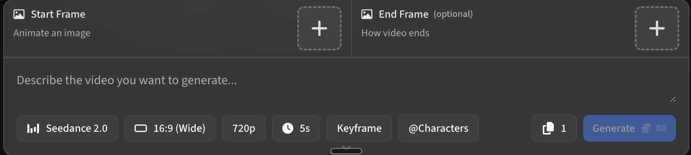
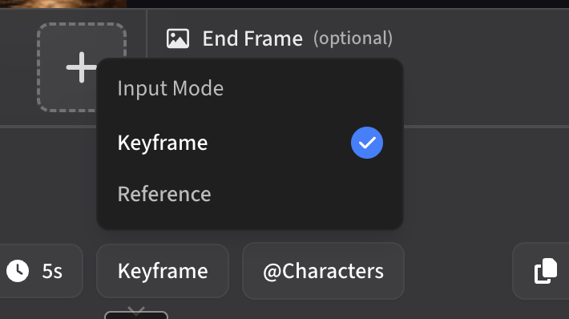

# ArtCraft UI Guide — How to Run a Seedance Shot

A producer's-eye walkthrough of the ArtCraft web interface ([getartcraft.com](https://getartcraft.com/)) for running Seedance 2.0 shots from this pipeline. Use this when you've just signed up and you're staring at the Generate page wondering where everything is.

> **TL;DR for first-time users:** ArtCraft is a single-page web app. The big text field in the middle is where the prompt goes. The bar of pill-shaped buttons across the bottom is where every per-shot setting lives — model, aspect ratio, resolution, runtime, input mode, character anchoring. You don't need any of the desktop app. Everything on this page is everything you need.

## The toolbar at a glance

This is what the ArtCraft generate panel looks like:

Top to bottom:

1. **Start Frame** *(left, "Animate an image")* — drop an image here when you want the video to start from that exact frame and animate forward. Most shots in this pipeline don't use this — we use **Reference mode** (covered below) for character / environment / prop anchoring instead. Leave Start Frame empty unless the orchestrator specifically tells you to animate from a still.
2. **End Frame** *(right, "How video ends," optional)* — drop an image here when you want the video to end on that exact frame. Useful for locking a final beat (a hero pose, a logo reveal, a specific look). Optional and rarely needed.
3. **Prompt field** *("Describe the video you want to generate…")* — this is where the Seedance prompt from `cinema-worldbuilder` goes. Paste the entire code block the specialist delivers, exactly as written — all ten labeled blocks (Scene & Mood → Camera Capture) and the inline `@imageN` tags, which map to the reference images attached in the numbered order from the delivery's reference list. Don't edit it down — `cinema-worldbuilder` writes prompts that fit Seedance's input budget.
4. **Bottom toolbar** *(left to right)* — the seven controls below. Each is a pill you click to open.

## The bottom toolbar — every per-shot setting

### Seedance 2.0 (model selector)

> 📊 **Seedance 2.0** ← click this if it shows a different model.

This is the video model. **Always confirm it's set to Seedance 2.0** before generating — every prompt in this pipeline is written for Seedance 2.0's specific grammar (the ten labeled blocks from Scene & Mood through Camera Capture, `@imageN` reference tags, the cinema-mode camera language). If ArtCraft has defaulted to a different model, click and switch.

### 16:9 (Wide) — aspect ratio

> 🖥 **16:9 (Wide)** ← click to change

Click and pick the aspect ratio for this shot. The orchestrator will tell you which to use per shot. Common choices:

- **16:9 (Wide)** — YouTube, TV, traditional cinema
- **9:16 (Tall)** — Instagram Reels, TikTok, YouTube Shorts, vertical mobile
- **1:1 (Square)** — Instagram feed posts
- **2.39:1 / 21:9** — anamorphic / cinematic letterbox (some hosts; check availability)
- **4:5** — Instagram portrait feed

**Set this per shot.** Don't assume the last shot's aspect ratio carries over — confirm before every generation.

### 720p — resolution

> 🖥 **720p** ← click to change

Resolution. **720p is the right default for this pipeline** — Topaz Video in post-production upscales 720p cleanly to 1080p or 4K, and generating at 720p costs significantly fewer credits than 1080p. Only generate at 1080p if you have a specific reason and credits to spare.

### 5s — runtime

> ⏱ **5s** ← click to change

Per-shot runtime. The orchestrator hands you the runtime for each shot from the shot list. Common values: 3s, 5s, 8s, 10s, 12s, 15s. **Every second costs credits**, so don't over-budget — if `cinema-worldbuilder` quotes 7 seconds, use 7 seconds, not 10.

### Keyframe — input mode (THIS IS HOW YOU ADD REFERENCES)

> 🕓 **Keyframe** ← click to change to **Reference**

This is the one that's hardest to find on your first shot. **By default, ArtCraft is in "Keyframe" input mode**, which means it expects Start Frame / End Frame images for first-frame and last-frame animation. To attach reference images (locked character sheets, environment plates, prop sheets — the heart of how this pipeline works), you have to switch to **Reference mode**.

**How:** click the "Keyframe" pill in the bottom toolbar. A small dropdown appears with two options:

- **Keyframe** *(default, currently checked)*
- **Reference** ← **click this**

Once you switch to Reference mode, the top of the panel changes from "Start Frame / End Frame" slots into a reference upload area. **Drag your locked references into the reference slots** (character sheet, environment plate, prop sheet — whichever the shot calls for, up to 9 individual images per generation). The orchestrator will tell you exactly which references to attach per shot.

This is the mode you'll use for almost every shot in the pipeline. Set it once at the start of your generate session; ArtCraft will usually remember it for subsequent shots, but **double-check** the toolbar pill says "Reference" before generating each shot — sometimes it reverts.

### @Characters — identity anchoring (optional)

> 👥 **@Characters** ← click to bind a specific character identity

If you've saved characters in ArtCraft's character library (built from your locked sheets), `@Characters` lets you bind one of them by name into the shot. This forces tighter identity lock than reference images alone. **Not required** — reference images attached via Reference mode work fine on their own — but useful if you find character drift creeping in across many shots of the same person.

### Copy count (📋 1) — batch generations

> 📋 **1** ← click to bump higher for parallel generations

The little "1" with the copy icon is **how many generations to run from this single prompt**. ArtCraft will run them in parallel and let you pick the winner. **Default to 1** for cost reasons. Bump to 2 or 3 only if you know this is a hard shot that's going to need multiple attempts anyway — burning the credits upfront and picking the best of three is cheaper than re-rolling three times sequentially.

### Generate (with credit cost preview)

> 🪙 **Generate · 80** ← click when everything is set

The blue **Generate** button on the right kicks off the actual generation. The number next to it (e.g. `80`) is the **credit cost** for this specific configuration — it updates live as you change aspect ratio, runtime, resolution, and copy count. **Always glance at this number before clicking Generate** — it's your cost preview. If it's way higher than you expected (e.g. 240 when you expected 80), something's misconfigured (probably runtime too long, resolution too high, or copy count above 1).

Click Generate. Wait. The clip appears in the gallery to the right of the generate panel when it's done.

## Per-shot generation checklist

Run this mentally (or actually) every single shot:

- [ ] **Prompt pasted** into the central text field, exactly as the orchestrator wrote it
- [ ] **Seedance 2.0** confirmed in the model pill
- [ ] **Aspect ratio** set for this shot (orchestrator tells you)
- [ ] **Resolution** at 720p (unless explicitly going 1080p)
- [ ] **Runtime** set to what the shot list says
- [ ] **Input mode** showing **Reference** (not Keyframe), references uploaded into the reference slots
- [ ] **Copy count** at 1 (unless you've already accepted you need parallel attempts)
- [ ] **Credit cost** in the Generate button matches what you expected (~$0.50–$1.00 per typical 5–10s shot at 720p)
- [ ] Click **Generate**

Then take the result back to your conversation with the orchestrator and say "Shot N kept" (save it), "Shot N iterate" (re-roll with a tweak), or "Shot N wasted" (log and move on).

## What you don't need (skip these)

- **Desktop app** — ArtCraft offers a downloadable desktop client. **Don't install it** for this pipeline. The web app has full feature parity and keeps your workflow simple (one browser tab for ArtCraft, one for the orchestrator conversation, one for ChatGPT image work). Adding a desktop app fragments your file paths and adds nothing.
- **Other models** in the model picker — the pipeline is Seedance 2.0-specific. Don't switch models mid-project; cinema-worldbuilder prompts won't translate cleanly.
- **Start Frame / End Frame slots** — these belong to Keyframe input mode (default), not Reference mode (what we use). Once you've switched to Reference mode, those slots disappear and reference slots take their place.

## When something goes wrong

- **Clip looks nothing like the references** → check the input mode pill in the toolbar. If it reverted to "Keyframe," your reference images were ignored. Switch back to Reference, re-attach, re-generate.
- **Credit cost on Generate button is way higher than expected** → check runtime (probably too long), resolution (might have flipped to 1080p), or copy count (might be above 1).
- **Character looks wrong** → check that the locked character sheet is one of the attached references. If you have a saved character in `@Characters`, bind it.
- **Wrong aspect ratio in the rendered clip** → the aspect pill must be clicked and confirmed before each generation. Don't trust the previous shot's setting to carry over.
- **You hit the monthly Basic-tier cap mid-project** → either wait until the cycle resets (date shown in account settings), upgrade tier inside ArtCraft, or for one or two specific shots, spin up a Higgsfield Plus month and use it just for those (see `docs/higgsfield-ui-guide.md`).

## See also

- `docs/higgsfield-ui-guide.md` — same walkthrough for Higgsfield Plus / Ultra (the professional-tier alternative)
- `ai-film-director/SKILL.md` Step 5.0.1 — the orchestrator's first-time host setup walkthrough that points here
- `CLAUDE.md` — the workspace-level overview of where ArtCraft fits in the full production stack
