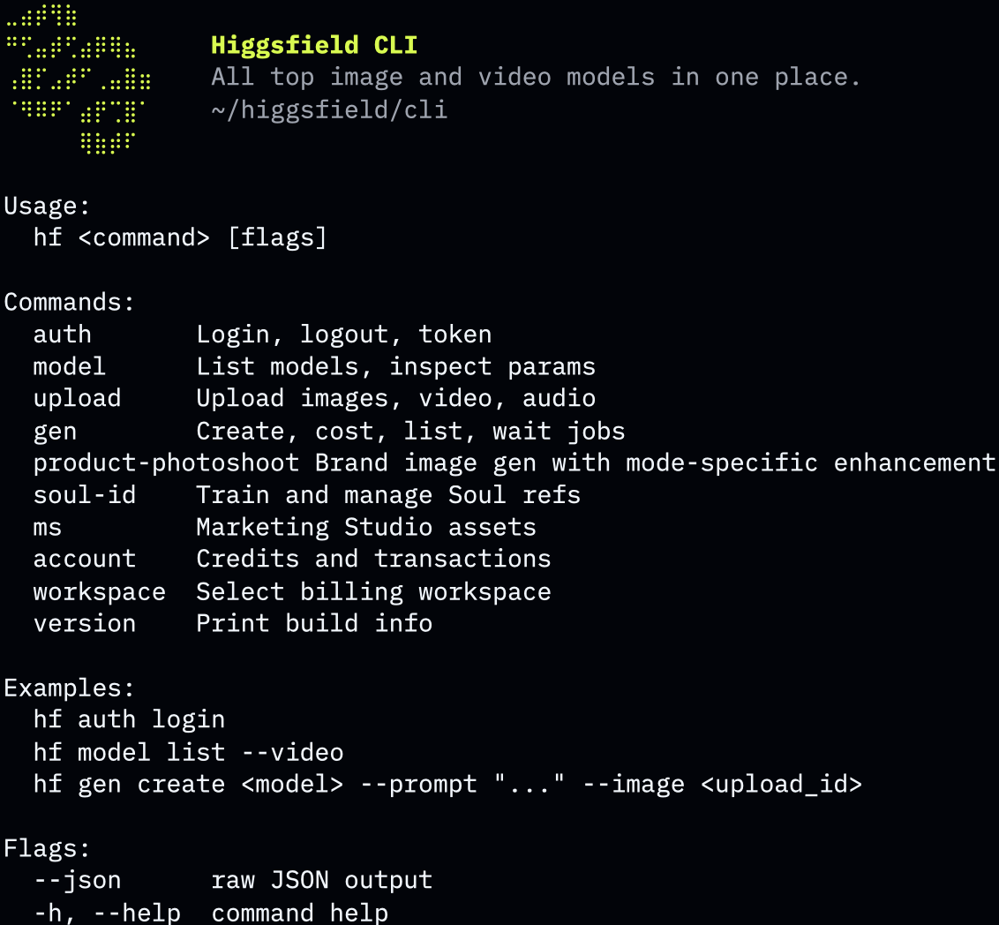

# Higgsfield CLI

[](https://github.com/higgsfield-ai/cli/releases)
[](https://www.npmjs.com/package/@higgsfield/cli)
[](./LICENSE)

Generate images, videos, 3D assets, audio, and finished-video analysis from the terminal using 40+ [Higgsfield AI](https://higgsfield.ai) models — Nano Banana Pro, Nano Banana 2 Lite, Gemini Omni Flash, FLUX.2, Soul V2, Veo 3.1, Kling v3.0, Seedance 2.5, Marketing Studio, Virality Predictor, and more. Train face-faithful Soul characters and produce branded marketing assets without leaving your shell.



## Contents

- [Install](#install)
- [Quickstart](#quickstart)
- [Examples](#examples)
- [Models](#models)
- [Workflows](#workflows)
- [Video Explainer](#video-explainer)
- [Games](#games)
- [Websites](#websites)
- [Commands](#commands)
- [Flags](#flags)
- [Updating](#updating)
- [Uninstall](#uninstall)
- [Troubleshooting](#troubleshooting)
- [Support](#support)
- [License](#license)

## Install

### macOS / Linux — curl

```bash
curl -fsSL https://raw.githubusercontent.com/higgsfield-ai/cli/main/install.sh | sh
```

### macOS / Linux — Homebrew

```bash
brew install higgsfield-ai/tap/higgsfield
```

### Cross-platform (incl. Windows) — npm

```bash
npm install -g @higgsfield/cli
```

### Manual

Download an archive matching your OS and architecture from [Releases](https://github.com/higgsfield-ai/cli/releases), extract, and place the binary in your `$PATH`.

## Quickstart

Authenticate:

```bash
higgsfield auth login
```

Generate an image and wait for the result URL:

```bash
higgsfield generate create nano_banana_2 --prompt "a quiet beach at sunrise" --wait
```

## Examples

### Nano Banana Pro

```bash
higgsfield generate create nano_banana_2 \
  --prompt "modern architecture, glass facade, golden hour light" \
  --aspect_ratio 16:9 \
  --resolution 2k \
  --wait
```

### GPT Image 2.5

Recommended default for image generation, design, and on-image text.

```bash
higgsfield generate create gpt_image_2_5 \
  --prompt "clean infographic showing global energy mix, flat icons, muted palette" \
  --aspect_ratio 3:4 \
  --quality high --resolution 2k \
  --wait
```

### Kling v3.0

```bash
higgsfield generate create kling3_0 \
  --prompt "slow camera push through a forest clearing at dawn" \
  --start-image ./first.png \
  --duration 5 --mode pro --sound off \
  --wait
```

### Seedance 2.5

SOTA default for general video generation.

```bash
higgsfield generate create seedance_2_5 \
  --prompt "drone shot over a mountain valley at sunrise" \
  --aspect_ratio 16:9 --duration 5 \
  --resolution 1080p --mode t2v --bitrate_mode high \
  --wait
```

### Virality Predictor

`brain_activity` is the technical job set type for Virality Predictor. It
analyzes a finished video for hook strength, attention, retention, and viral
potential, then prints scores plus an Open report link.

```bash
higgsfield generate create brain_activity --video ./ad.mp4 --wait
higgsfield generate get <job_id>
higgsfield generate wait <job_id>
```

### Draw To Video

Edit a video from a source clip plus an edited sketch frame:

```bash
higgsfield generate workflow draw_to_video \
  --video ./source.mp4 \
  --sketch ./frame.png \
  --timestamp 3.2 \
  --prompt "make the jacket red" \
  --wait
```

### Reframe

Reframe a source video for a new aspect ratio:

```bash
higgsfield generate workflow reframe \
  --video ./source.mp4 \
  --aspect-ratio 9:16 \
  --resolution 720p \
  --wait
```

### Voice Change

Replace the voice on a source video with a chosen voice:

```bash
higgsfield generate workflow voice-change \
  --video ./source.mp4 \
  --voice_type preset \
  --voice_id <voice_id> \
  --wait
```

### Dubbing

Dub a source video into another language (`--target_language` is an ISO-639-3 code,
e.g. `eng`, `spa`, `fra`, `deu`, `jpn`; run `higgsfield workflow get dubbing` for the full list):

```bash
higgsfield generate workflow dubbing \
  --video ./source.mp4 \
  --target_language spa \
  --wait
```

### Voices

List available voices (presets + your custom voices) to get a `voice_id` for
`text2speech_v2` and `voice-change`. Use a voice's `id` as `--voice_id` and its
`type` (`preset`/`element`) as `--voice_type`:

```bash
higgsfield voices list
higgsfield voices get <voice_id> --json
```

### Video Explainer

The explainer skill builds matched 10-second blocks: resolve a style, generate
all narration with Seed Audio first, generate the corresponding Gemini Omni
clips second, then assemble the ordered pairs with `explainer_video`:

```bash
higgsfield preset list video-explainer --json
higgsfield preset resolve video-explainer <preset_id> --json
higgsfield voices list --json

higgsfield generate create seed_audio \
  --prompt "<Block 1 narration>" \
  --voice_type preset --voice_id <voice_id> --wait --json

higgsfield generate create gemini_omni \
  --prompt "<Block 1 visual prompt>" \
  --image <resolved_style_media_id> \
  --duration 10 --resolution 720p --aspect_ratio 16:9 --wait --json

higgsfield generate create explainer_video \
  --items @blocks.json --width 1280 --height 720 --wait --json
```

Repeat the audio/video calls once per block. `blocks.json` maps every clip job to
its matching audio job in playback order. See
[MODELS.md](./MODELS.md#video-explainer-jobs) for the assembler schema and
optional subtitle fonts.

### Games

Deploy a browser-game ZIP whose root contains `index.html` and either `logic.js`
or `server.js`:

```bash
higgsfield game deploy ./game.zip \
  --title "Space Runner" \
  --description "Fast arcade survival game" \
  --thumbnail https://cdn.example/cover.png \
  --favicon https://cdn.example/icon.png \
  --json
```

Update the same game with `--game-id <game_id>`. Marketplace publication is a
separate action:

```bash
higgsfield game publish <game_id> --name "Space Runner" --json
```

Browse the rigged 3D animation catalog before choosing an
`animation_action_id`:

```bash
higgsfield preset list animation-action --query walk
higgsfield preset list animation-action --group Fighting --category Punching --json
```

### Soul ID

Train a Soul ID once:

```bash
higgsfield soul-id create --name me --soul-2 \
  --image ./me1.jpg --image ./me2.jpg --image ./me3.jpg
higgsfield soul-id wait <soul_id>
```

Reuse it in any compatible image model:

```bash
higgsfield generate create text2image_soul_v2 \
  --prompt "professional portrait, neutral background, soft daylight" \
  --soul-id <soul_id> \
  --wait
```

## Models

40+ image, video, 3D, and audio models. Per-model parameters, defaults, and enums: [MODELS.md](./MODELS.md). Live catalog: `higgsfield model list`.

### Image (23)

| job_set_type | name |
|---|---|
| `nano_banana_2` | Nano Banana Pro |
| `nano_banana_2_lite` | Nano Banana 2 Lite |
| `nano_banana_flash` | Nano Banana 2 |
| `nano_banana` | Nano Banana |
| `flux_2` | FLUX.2 |
| `flux_kontext` | Flux Kontext |
| `gpt_image_2` | GPT Image 2 |
| `gpt_image_2_5` | GPT Image 2.5 |
| `text2image_soul_v2` | Higgsfield Soul V2 |
| `seedream_v4_5` | Seedream 4.5 |
| `seedream_v5_lite` | Seedream V5 Lite |
| `grok_image` | Grok Image |
| `openai_hazel` | OpenAI Hazel |
| `outpaint` | Outpaint |
| `recraft_v4_1` | Recraft V4.1 |
| `image_auto` | Image Auto |
| `image_background_remover` | Image Background Remover |
| `z_image` | Z Image |
| `kling_omni_image` | Kling O1 Image |
| `cinematic_studio_2_5` | Cinematic Studio 2.5 |
| `soul_cinematic` | Soul Cinematic |
| `soul_location` | Soul Location |
| `soul_cast` | Soul Cast |
| `marketing_studio_image` | Marketing Studio Image |

### Video (22)

| job_set_type | name |
|---|---|
| `brain_activity` | Virality Predictor |
| `gemini_omni` | Gemini Omni Flash |
| `veo3_1` | Google Veo 3.1 |
| `veo3_1_lite` | Google Veo 3.1 Lite |
| `veo3` | Google Veo 3 |
| `kling3_0` | Kling v3.0 |
| `kling3_0_turbo` | Kling 3.0 Turbo |
| `kling2_6` | Kling 2.6 Video |
| `seedance_2_5` | Seedance 2.5 |
| `seedance_2_0` | Seedance 2.0 |
| `seedance_2_0_mini` | Seedance 2.0 Mini |
| `seedance1_5` | Seedance 1.5 Pro |
| `wan2_7` | Wan 2.7 |
| `wan2_6` | Wan 2.6 Video |
| `minimax_hailuo` | Minimax Hailuo |
| `grok_video` | Grok Video |
| `grok_video_v15` | Grok Video 1.5 |
| `cinematic_studio_3_0` | Cinematic Studio 3.0 |
| `cinematic_studio_video` | Cinematic Studio Video |
| `cinematic_studio_video_3_5` | Cinematic Studio Video 3.5 |
| `cinematic_studio_video_v2` | Cinematic Studio Video V2 |
| `marketing_studio_video` | Marketing Studio Video |
| `video_background_remover` | Video Background Remover |

### 3D (5)

| job_set_type | name |
|---|---|
| `multi_image_to_3d` | Multi-Image to 3D |
| `image_to_3d` | Image to 3D |
| `tripo_3d` | Text to 3D |
| `sam_3_3d` | 3D Objects |
| `3d_rigging` | 3D Rigging |

### Audio (5)

| job_set_type | name |
|---|---|
| `seed_audio` | Seed Audio 1.0 |
| `sonilo_music` | Sonilo Music |
| `mirelo_text_to_audio` | Mirelo Text to Audio |
| `text2speech_v2` | Text to Speech |
| `inworld_text_to_speech` | Inworld Text to Speech |

`text2speech_v2` turns text into speech with a chosen voice. Pick the engine with
`--variant` (`elevenlabs`, `minimax`, `seed_speech`, `vibe_voice`, `cozy_voice`) and the
voice with `--voice_type` (`preset` or `element`) + `--voice_id`. Discover voices with
`higgsfield voices list`.

```bash
higgsfield generate create text2speech_v2 \
  --prompt "Hello from Higgsfield" \
  --variant elevenlabs \
  --voice_type preset \
  --voice_id <voice_id> \
  --wait
```

## Workflows

Workflows are higher-level generation flows with their own parameter schemas.
Use `workflow list` to discover available workflows and `workflow get` to
inspect the parameters before creating a job.

```bash
higgsfield workflow list
higgsfield workflow get draw_to_video
higgsfield workflow get reframe --json
higgsfield workflow get voice-change
higgsfield workflow get dubbing
```

Create workflow jobs through `generate workflow`:

```bash
higgsfield generate workflow draw_to_video \
  --video ./source.mp4 \
  --sketch ./frame.png \
  --timestamp 3.2 \
  --prompt "make the jacket red" \
  --wait

higgsfield generate workflow reframe \
  --video ./source.mp4 \
  --aspect-ratio 9:16 \
  --resolution 720p \
  --wait

higgsfield generate workflow voice-change \
  --video ./source.mp4 \
  --voice_type preset \
  --voice_id <voice_id> \
  --wait

higgsfield generate workflow dubbing \
  --video ./source.mp4 \
  --target_language spa \
  --wait
```

Estimate workflow cost through `generate cost workflow`:

```bash
higgsfield generate cost workflow draw_to_video --duration 8.2 --resolution 720p
higgsfield generate cost workflow reframe --duration 7.1 --resolution 1080p
```

`voice-change` and `dubbing` do not support cost estimation.

Fetch or wait for workflow jobs with the same job commands used by model
generations:

```bash
higgsfield generate get <job_id>
higgsfield generate wait <job_id>
```

## Websites

Build and deploy full-stack websites from the terminal. Each site is a React 19 +
TanStack Start app, server-rendered as a single Cloudflare Worker, with D1, R2, KV,
Durable Objects, and Containers available. `higgsfield website create` provisions the
site and a git repo; you clone it, edit the code under `app/`, push, and deploy to
its live URL. The build runs on the Higgsfield platform from the pushed
branch.

`create` requires `--type` — what kind of product you're building:

- **`website`** — a standalone site with no Higgsfield integration (no
  "Sign in with Higgsfield", no requests to Higgsfield). Landing pages,
  portfolios, general tools.
- **`app`** — a product tightly integrated with Higgsfield: its users sign in
  with Higgsfield and generate images/videos through the Higgsfield SDK.

`create` also requires `--category` — the content category the site is filed
under on the marketplace. It's a slug from a curated taxonomy (e.g.
`cinematic`, `ads-marketing`, `ugc-social`, `other`); run
`higgsfield website categories` to see the full list, then pass the closest one
(use `other` when nothing fits). The taxonomy can grow over time, so the server
validates the slug and rejects an unknown one.

`--type app` also requires `--template`. The flag has exactly four choices:

| Template | Pick when |
|---|---|
| `app-detail` | a single tool's public landing page, with a generator hero and how-it-works flow |
| `preset` | pick-a-style generation, preset galleries, wizards, or upload/configure/iterate workflows |
| `studio` | a full creative workspace with projects, prompt dock, settings, and a generations feed |
| `custom` | a bare scaffold with no shipped layout; use only when the user explicitly requests a custom/bare scaffold |

Pick the closest of `app-detail`, `preset`, and `studio`. Agents must never
choose `custom` by default.

For every non-custom app template, the starter repo ships real code at
`app/src/layouts/<template>.tsx`, already wired as the home page. Adapt that
layout in place and thread real data through it; do not rebuild it, replace it,
or swap it for another layout. The shipped UI includes demo placeholders, so
it still needs the product's real business logic. After cloning, read both
`app/src/layouts/AGENTS.md` and `app/src/components/AGENTS.md` before editing.

Template validation happens locally: a missing or invalid app template fails
before authentication or any backend call. `--type website` does not require a
template. If `--template` is supplied for a standalone website, the CLI ignores
it and omits it from both the backend request and the create result.

Pass `--subdomain` to choose the site's subdomain — it becomes the slug, so the
live URL is `<subdomain>.<host>`. Always set one derived from the site's name
(lowercase, DNS-safe: letters, digits, single hyphens); omit it only if you want
a random subdomain. Reserved labels (e.g. `api`, `www`) and already-taken
subdomains are rejected — pick another.

Create a standalone website or an app using the closest starter template:

```bash
higgsfield website create --type website --category other

higgsfield website create \
  --type app \
  --category product-ecommerce \
  --template app-detail

higgsfield website create \
  --type app \
  --category ads-marketing \
  --template preset \
  --subdomain my-app

higgsfield website create \
  --type app \
  --category cinematic \
  --template studio
```

App create results preserve the selected template. Human-readable table output
includes **Category** and **Template** columns (alongside Website ID, Type,
Slug, Name, Preview URL, and Production URL), and non-custom apps also print the
shipped layout path. JSON output includes `"template"` for apps:

```json
{
  "website_id": "<website_id>",
  "type": "app",
  "template": "studio"
}
```

Standalone website results omit `template`, including when an ignored
`--template` was supplied; table output leaves the Template cell empty, while
JSON has no `template` field.

Continue with the returned `website_id`:

```bash
# 1. Create the site + its git repo using one of the commands above.
#    Prefer a DNS-safe --subdomain derived from the site's name.

# 2. Get the clone URL, branch, and a scoped git token
higgsfield website repo-access <website_id>

# 3. Clone with the token, edit under app/, commit, and push
git -c http.extraHeader="Authorization: token <token>" clone <repo_url> <slug>
cd <slug>
# The scaffolded clone has no git identity — set one or the first commit fails:
git config user.email "agent@higgsfield.ai" && git config user.name "Higgsfield Agent"
# ...edit files under app/ (bun-only repo: bun install / bun add / bunx /
#    bun run typecheck|build — never npm/npx/yarn; app/src/routeTree.gen.ts
#    is generated, never hand-edit it) ...
git add -A && git commit -m "initial build"
git -c http.extraHeader="Authorization: token <token>" push origin <branch>

# 4. Deploy — ships the live site (run it again after every change)
higgsfield website deploy <website_id>

# Publish — list the site on the Higgsfield community feed ("show in feed")
# where others can discover and remix it. Publish does NOT deploy: it lists
# whatever `deploy` last shipped, so deploy first (and again after any change).
# Prints the community-feed listing URL.
higgsfield website publish <website_id>

# Enter the $100k Higgsfield app contest (type: app). The entry PUBLISHES the
# app for you — no separate `publish` needed; it just needs a live deploy and
# filled page metadata. Pass one or more public social links (Instagram /
# TikTok / YouTube / X) promoting it. Re-running overwrites the links.
higgsfield website contest <website_id> --url https://x.com/<user>/status/...

# Check deploy status and the live URL any time
higgsfield website status <website_id>
```

Rename a site's subdomain (the slug in its public URL). The site is re-deployed
under the new subdomain and the **old subdomain stops working** — share the new
URL afterwards. Storage (database, files, config) and the git repo are kept.
Blocking like deploy (a couple of minutes); reserved or taken subdomains are
rejected — pick another:

```bash
higgsfield website rename <website_id> --subdomain my-new-name
```

Inspect the site's database (read-only) and manage secrets (staged until the next deploy):

```bash
higgsfield website db tables <website_id>
higgsfield website db rows <website_id> --table users --limit 20
higgsfield website db query <website_id> --sql "SELECT count(*) FROM users"

higgsfield website secrets set <website_id> --name STRIPE_SECRET_KEY --value sk_live_...
higgsfield website secrets list <website_id>
```

List the sites you own:

```bash
higgsfield website list
```

List the content categories a site can be filed under (the `--category` slugs
for `create`), each with its slug, label, and description:

```bash
higgsfield website categories
```

Add `--json` to any command for machine-readable output.

## Commands

| Command | Purpose |
|---|---|
| `higgsfield auth` | login / logout / inspect token |
| `higgsfield account` | credits balance, transactions |
| `higgsfield workspace` | list / select / unset billing workspace |
| `higgsfield model` | list models, inspect parameter schema |
| `higgsfield generate` | create / cost / wait / get / list jobs |
| `higgsfield workflow` | list workflows, inspect workflow parameter schema |
| `higgsfield preset` | list server-managed styles/actions and resolve explainer style inputs |
| `higgsfield game` | deploy browser-game ZIPs and explicitly publish marketplace listings |
| `higgsfield voices` | list voices / inspect a voice for text2speech & voice-change |
| `higgsfield upload` | upload an image / video / audio file |
| `higgsfield soul-id` | train and manage Soul characters |
| `higgsfield marketing-studio` | branded ads (avatars, products, ad references, brand kits, ad formats, DTC Ads Engine) |
| `higgsfield product-photoshoot` | brand image generation with mode-specific enhancement |
| `higgsfield website` | create (`--type website\|app`, `--category <slug>`; apps require `--template app-detail\|preset\|studio\|custom`, with `custom` only by explicit request) / list categories / edit (via git repo access) / deploy / rename the subdomain / publish to the community feed / enter the app contest (auto-publishes) / inspect DB / manage secrets for full-stack websites |
| `higgsfield version` | print build info |

Run `higgsfield <command> --help` for flags and examples (also `higgsfield generate create --help`, `higgsfield soul-id create --help`, etc.).

## Flags

Flags work across all commands.

| Flag | Purpose |
|---|---|
| `--wait` | block until the job finishes; print the result URL |
| `--wait-timeout` | max wait duration (default `10m`) |
| `--wait-interval` | poll interval (default `3s`) |
| `--json` | machine-readable JSON output |
| `--no-color` | disable color output |

Example pipeline:

```bash
higgsfield generate list --json | jq -r '.[] | select(.status=="completed") | .result_url'
```

## Updating

```bash
# curl
curl -fsSL https://raw.githubusercontent.com/higgsfield-ai/cli/main/install.sh | sh

# brew
brew update && brew upgrade higgsfield

# npm
npm install -g @higgsfield/cli@latest
```

Pin to a specific release:

```bash
curl -fsSL https://raw.githubusercontent.com/higgsfield-ai/cli/main/install.sh | sh -s -- --tag v1.1.2
# or
npm install -g @higgsfield/cli@1.1.2
```

## Uninstall

```bash
# curl install (default prefix /usr/local)
sudo rm /usr/local/bin/higgsfield

# brew
brew uninstall higgsfield

# npm
npm uninstall -g @higgsfield/cli
```

## Troubleshooting

**`Session expired` / `Not authenticated`** — tokens are short-lived. Re-run `higgsfield auth login`.

**`Unknown model "<name>"`** — run `higgsfield model list` for the current catalog.

## Support

Bugs and feature requests: [github.com/higgsfield-ai/cli/issues](https://github.com/higgsfield-ai/cli/issues). Please include `higgsfield version` output and the exact command that failed.

## License

[MIT](./LICENSE)
