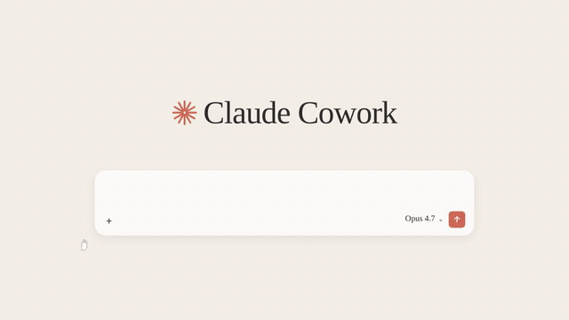

# Creativly.ai — Higgsfield Brand Launch Video, Recreated in Remotion

> A frame-accurate recreation of the **Higgsfield** launch/brand film, rebuilt entirely in code with [Remotion](https://www.remotion.dev), React and TypeScript — open-sourced by **[Naveen Annam](https://github.com/naveen-annam)** at **[Creativly.ai](https://www.creativly.ai)**.

<p align="center">
  <a href="https://www.youtube.com/watch?v=9APVoE65qfs">
    
  </a>
</p>

<p align="center">▶️ <b><a href="https://www.youtube.com/watch?v=9APVoE65qfs">Watch the full film on YouTube</a></b></p>

<p align="center">
  
</p>

This repo is part of a series where **[Naveen Annam](https://github.com/naveen-annam)** — founder of **[Creativly.ai](https://www.creativly.ai)** — takes a well-known AI brand's launch video and recreates it **programmatically** — no timeline editor, no After Effects. Every segment, transition, and reveal is written as React components and rendered deterministically with Remotion. It doubles as a real-world reference for anyone who wants to build **AI brand videos in Remotion**.

## ✨ What this is

- **~53-second brand film** (1591 frames @ 30fps, 1920×1080) recreated segment-for-segment across **11 scenes**.
- **100% code-driven motion** — springs, easings, and beats live in a single [`src/tokens.ts`](src/tokens.ts) source of truth.
- **AI-generated assets** (creator shots, product/boutique scenes, masonry card grids) shipped pre-rendered in [`public/aigen`](public/aigen) — only the finished assets the video needs are included.

## 🎬 Structure

The film is an 11-segment sequence (`Scene01_Seg000` … `Scene11_Seg010`), each defined as its own React component and timed from the shared `BEATS` table in [`src/tokens.ts`](src/tokens.ts). Segments range from quick ~3s cuts to ~6s hero holds, stitched together in [`src/VideoComposition.tsx`](src/VideoComposition.tsx).

## 🚀 Quick start

```bash
pnpm install          # or npm install / yarn
pnpm dev              # open Remotion Studio to preview + scrub
pnpm render           # render to out/final.mp4
```

Other scripts:

```bash
pnpm still            # export a single still frame
pnpm compositions     # list compositions
pnpm check            # typecheck (tsc --noEmit)
```

## 🗂 Project structure

```
src/
  Root.tsx              # registers the <Composition>
  VideoComposition.tsx  # top-level sequence: stitches all 11 segments
  tokens.ts             # palette, fonts, motion, beat timings
  helpers.ts            # font loading + shared animation helpers
  scenes/               # one file per segment (Scene01…Scene11)
public/
  aigen/                # AI-generated scene assets
```

## 🛠 Built with

- [Remotion](https://www.remotion.dev) `4.0.x` — React-based programmatic video
- React 19 + TypeScript
- `@remotion/google-fonts`, `@remotion/transitions`

## 🎥 About

Built and open-sourced by **[Naveen Annam](https://github.com/naveen-annam)**, founder of **[Creativly.ai](https://www.creativly.ai)**.

**Creativly** is an AI creative studio — *one workspace to generate, edit, and ship images, video, audio, and text without switching tools.* It brings the leading models (OpenAI GPT Image 2, Google Gemini, Veo 3, Nano Banana 2 & Omni Flash, Kling 3, Runway, FLUX 2, Seedance 2, Seedream 4.5, and more) onto a single canvas, with a visual workflow builder (**Flow**), a chat-driven **Agent**, a timeline **Video Editor**, and production-ready templates for ads, UGC, product shots, and campaigns — run on Creativly credits or bring your own API keys.

This repo is one of those recreations — proof that polished **brand videos can be built entirely in [Remotion](https://www.remotion.dev)**. Fork it and remix it for your own launch.

If this helped you, a ⭐ is appreciated.

## 📄 License

[MIT](LICENSE) © 2026 Naveen Annam (Creativly.ai). Recreation for educational/showcase purposes; "Higgsfield" and related marks belong to their respective owners.
